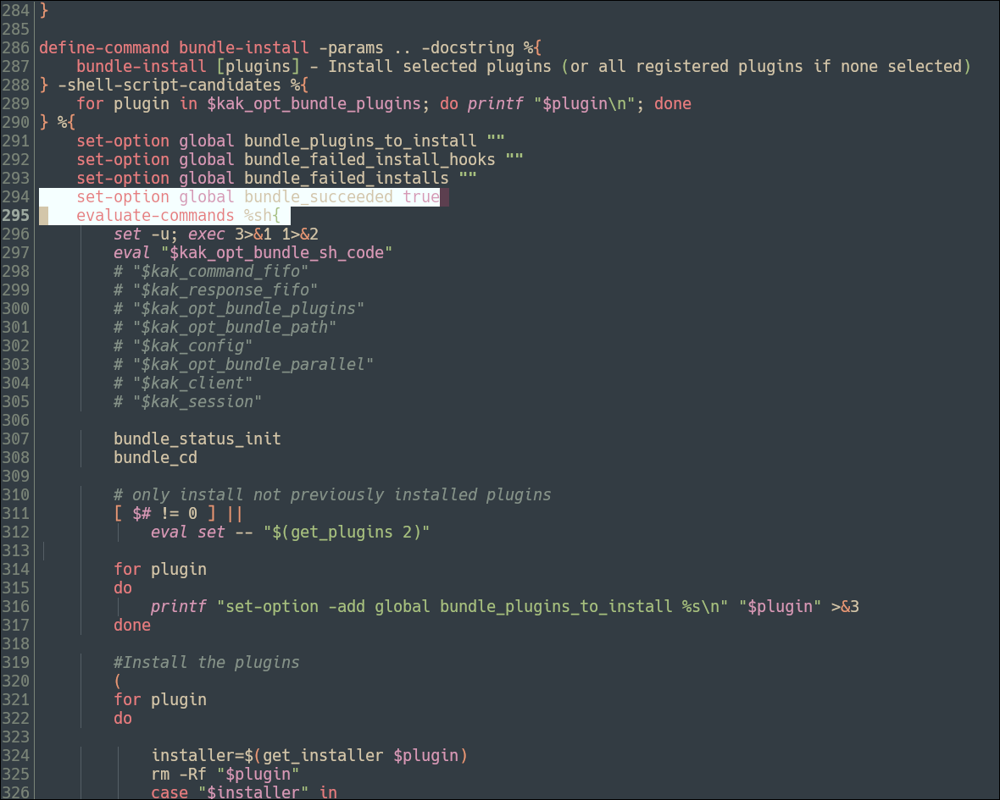
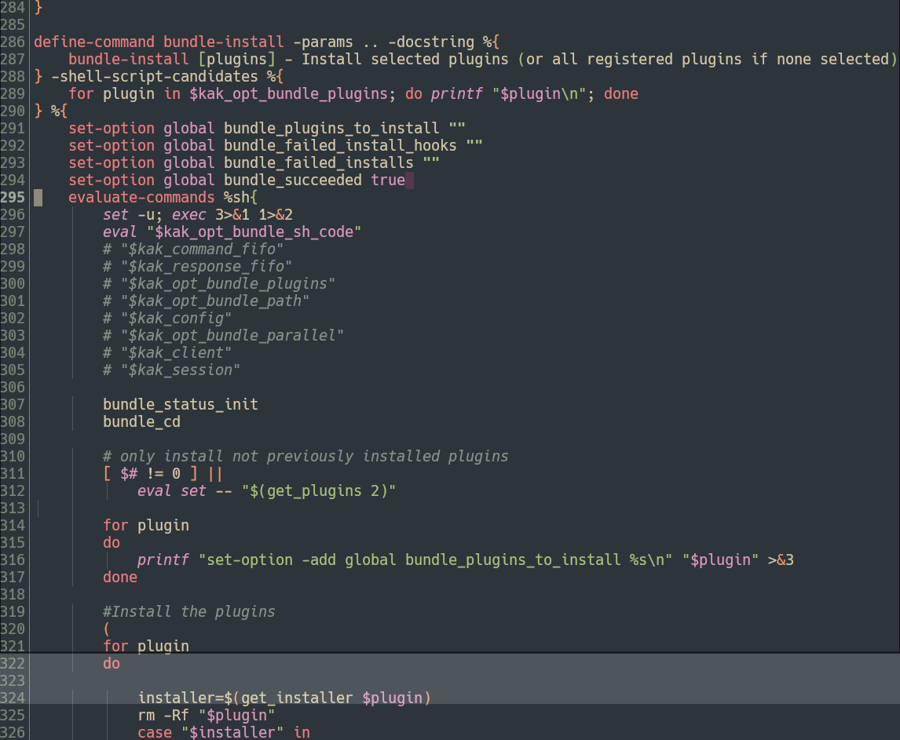
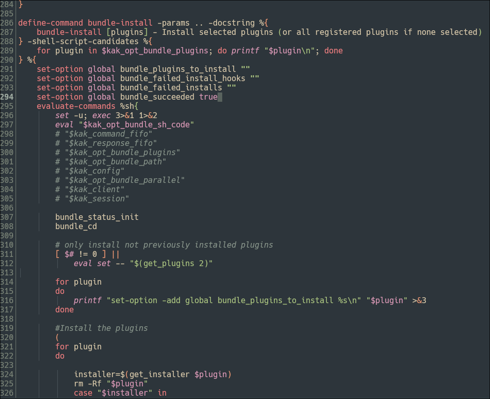
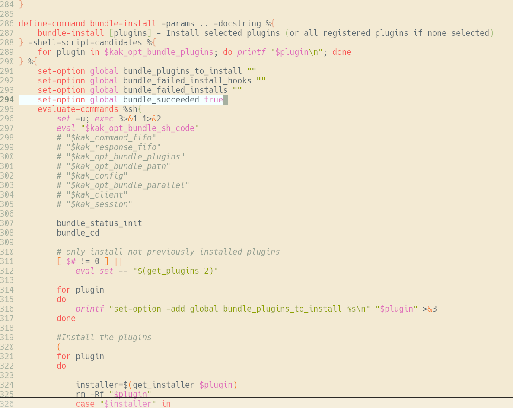
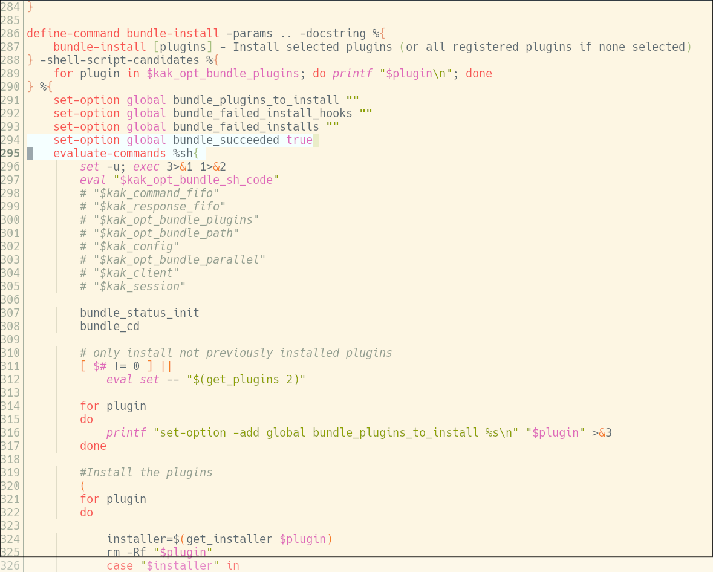
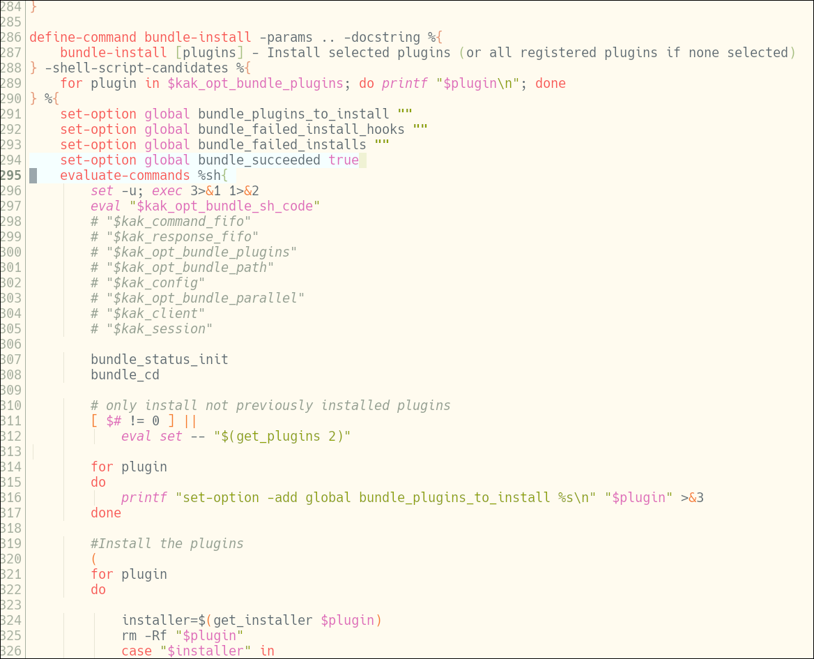
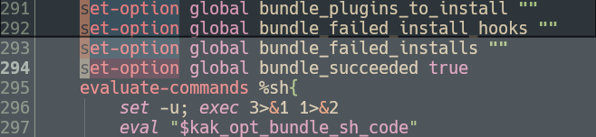
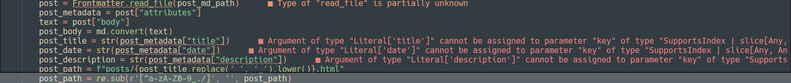

# everforest.kak

everforest.kak is an [everforest](https://github.com/sainnhe/everforest) colorscheme port for [Kakoune](https://github.com/mawww/kakoune).
It has light and dark variants in three different contrast levels, soft, medium, and hard.
The variants are as follows:

## everforest-dark-soft


## everforest-dark-medium


## everforest-dark-hard


## everforest-light-soft


## everforest-light-medium


## everforest-light-hard


# Installation

## [kak-bundle](https://codeberg.org/jdugan6240/kak-bundle)

Add the following to your kakrc:

```kak
bundle-theme https://codeberg.org/jdugan6240/everforest.kak

# Somewhere in your kakrc...
colorscheme everforest-dark-soft # or whichever variant you want...
```

## Manual

Install the files in the `colors` subdirectory in `(kak configuration)/colors`, and then put the following somewhere in your kakrc:

```kak
colorscheme everforest-dark-soft # or whichever variant you want...
```

# Plugin support

everforest.kak has explicit support for the following plugins:

* [kakoune-lsp](https://github.com/kakoune-lsp/kakoune-lsp)
  * LSP info boxes are syntax highlighted
  * LSP diagnostics are colored as:
    * Error: red
    * Warning: orange
    * Info: blue
    * Hint: white
  * Inline diagnostics are marked with colored curly underlines (this feature may not work on all terminal emulators)
* [powerline.kak](https://github.com/andreyorst/powerline.kak)
  * Themes are provided for each variant.
* [kak-rainbower](https://github.com/crizan/kak-rainbower)/[kak-rainbow](https://github.com/Bodhizafa/kak-rainbow)
  * Brackets are colored orange, green, purple.
* [kakeidoscope](https://git.sr.ht/~orchid/kakeidoscope)
  * Brackets are colored orange, green, purple.
* [kak-tree-sitter](https://git.sr.ht/~hadronized/kak-tree-sitter)
  * kak-tree-sitter's faces are fully supported.

# Feature Screenshots

## Obvious Secondary Selections


## kakoune-lsp diagnostics


Curly and/or colored underlines may not display on all terminal emulators.

# FAQ

## Colored underlines don't look right under WezTerm

WezTerm's current release has a 32-parameter limit on CSI sequences.
Kakoune often uses CSI sequences longer than this, so some elements (underline colors, for instance) are just dropped.

This is fixed in WezTerm nightly, so the best solution is to just use that.
However, if for whatever reason you cannot, then the other solution is to patch Kakoune.
This obviously requires building Kakoune from source, and this patch could break at any time, so do this at your own peril.

In the Kakoune source repo, find the following function in src/terminal_ui.cc:

```cpp
void TerminalUI::Screen::set_face(const Face& face, Writer& writer)
{
    static constexpr int fg_table[]{ 39, 30, 31, 32, 33, 34, 35, 36, 37, 90, 91, 92, 93, 94, 95, 96, 97 };
    static constexpr int bg_table[]{ 49, 40, 41, 42, 43, 44, 45, 46, 47, 100, 101, 102, 103, 104, 105, 106, 107 };
    static constexpr int ul_table[]{ 0, 0, 1, 2, 3, 4, 5, 6, 7, 8, 9, 10, 11, 12, 13, 14, 15 };
    static constexpr const char* attr_table[]{ "0", "4", "4:3", "21", "7", "5", "1", "2", "3", "9" };

    auto set_color = [&](bool fg, const Color& color, bool join) {
        if (join)
            writer.write(";");
        if (color.isRGB())
            format_with(writer, "{};2;{};{};{}", fg ? 38 : 48, color.r, color.g, color.b);
        else
            format_with(writer, "{}", (fg ? fg_table : bg_table)[(int)(char)color.color]);
    };

    if (m_active_face == face)
        return;

    writer.write("\033[");
    bool join = false;
    if (face.attributes != m_active_face.attributes)
    {
        for (int i = 0; i < std::size(attr_table); ++i)
        {
            if (face.attributes & (Attribute)(1 << i))
                format_with(writer, ";{}", attr_table[i]);
        }
        m_active_face.fg = m_active_face.bg = m_active_face.underline = Color::Default;
        join = true;
    }
    if (m_active_face.fg != face.fg)
    {
        set_color(true, face.fg, join);
        join = true;
    }
    if (m_active_face.bg != face.bg)
    {
        set_color(false, face.bg, join);
        join = true;
    }
    if (m_active_face.underline != face.underline)
    {
        if (join)
            writer.write(";");
        if (face.underline != Color::Default)
        {
            if (face.underline.isRGB())
                format_with(writer, "58:2::{}:{}:{}", face.underline.r, face.underline.g, face.underline.b);
            else
                format_with(writer, "58:5:{}", ul_table[(int)(char)face.underline.color]);
        }
        else
            format_with(writer, "59");
    }
    writer.write("m");

    m_active_face = face;
}
```

Replace it with this code:

```cpp
void TerminalUI::Screen::set_face(const Face& face, Writer& writer)
{
    static constexpr int fg_table[]{ 39, 30, 31, 32, 33, 34, 35, 36, 37, 90, 91, 92, 93, 94, 95, 96, 97 };
    static constexpr int bg_table[]{ 49, 40, 41, 42, 43, 44, 45, 46, 47, 100, 101, 102, 103, 104, 105, 106, 107 };
    static constexpr int ul_table[]{ 0, 0, 1, 2, 3, 4, 5, 6, 7, 8, 9, 10, 11, 12, 13, 14, 15 };
    static constexpr const char* attr_table[]{ "0", "4", "4:3", "21", "7", "5", "1", "2", "3", "9" };

    auto set_color = [&](bool fg, const Color& color) {
        if (color.isRGB())
            format_with(writer, "\033[{};2;{};{};{}m", fg ? 38 : 48, color.r, color.g, color.b);
        else
            format_with(writer, "\033[{}m", (fg ? fg_table : bg_table)[(int)(char)color.color]);
    };

    format_with(writer, "\033[0m");

    for (int i = 0; i < std::size(attr_table); ++i)
    {
        if (face.attributes & (Attribute)(1 << i))
            format_with(writer, "\033[{}m", attr_table[i]);
    }
    m_active_face.fg = m_active_face.bg = m_active_face.underline = Color::Default;

    if (m_active_face.fg != face.fg)
        set_color(true, face.fg);
    if (m_active_face.bg != face.bg)
        set_color(false, face.bg);
    if (m_active_face.underline != face.underline)
    {
        if (face.underline != Color::Default)
        {
            if (face.underline.isRGB())
                format_with(writer, "\033[58:2::{}:{}:{}m", face.underline.r, face.underline.g, face.underline.b);
            else
                format_with(writer, "\033[58:5:{}m", ul_table[(int)(char)face.underline.color]);
        }
        else
            format_with(writer, "\033[59m");
    }

    m_active_face = face;
}
```

Then, build Kakoune as you normally would.

The idea is to split up the individual attributes that normally go into a single CSI sequence into multiple, so we don't hit the 32-parameter limit.
